# Production Data Mesh — Federated Governance & Cross-Cloud Query Without ETL

*A Data Engineering Project*

```text
💡 Click "⋮≡" at top right to show the table of contents.
```

## **Project Overview**

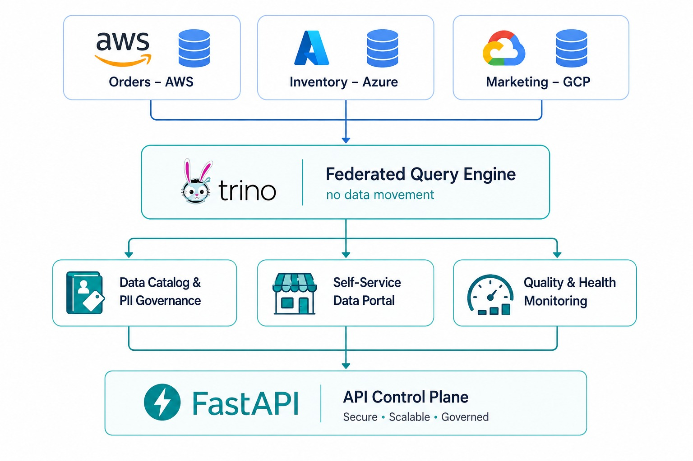

This is a **working backend prototype of a Data Mesh**: three domain-owned data
products (Orders, Inventory, Marketing) living in three separate cloud stores,
queried together through a single federated SQL engine — **with no data movement**.

**The project was created to practice and demonstrate the full architecture of an
enterprise Data Mesh** covering domain data ownership, data contracts, cross-cloud
federation, a self-service data catalog, automated PII governance, quality/SLA
enforcement, mesh-health monitoring, and an identity layer — all exposed through a
single **FastAPI** control plane that runs entirely on a laptop.

Large enterprises keep data in silos — Orders on AWS, Inventory on Azure, Marketing
on GCP. Answering one cross-domain question normally means building brittle, slow ETL
pipelines that copy data between clouds. A **Data Mesh** flips this: each team *owns*
its data as a product (with a schema contract, quality contract and an owner), and a
**federation layer** lets anyone query across all of them in one SQL statement without
copying anything.

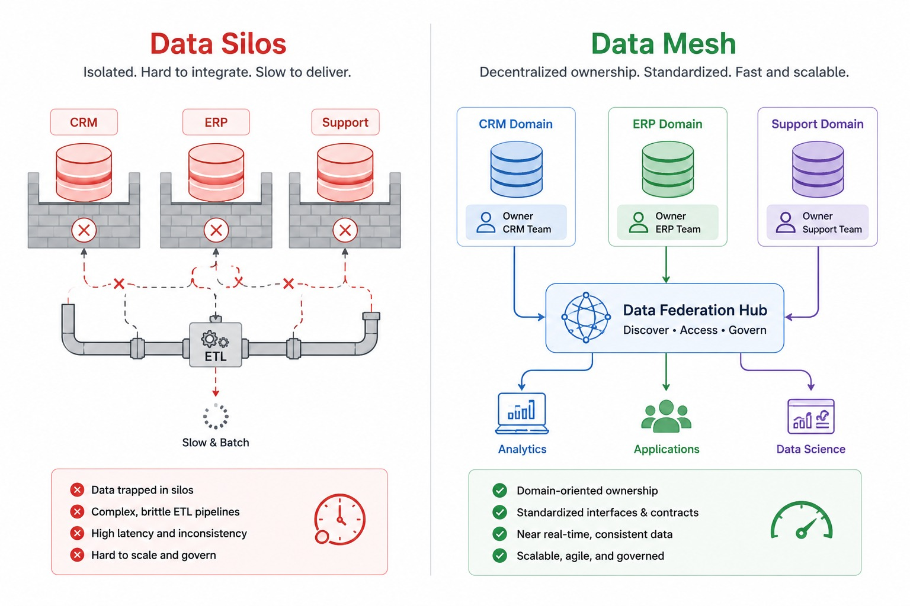

This project keeps the exact architecture of the enterprise design but runs entirely on
your laptop with Python + SQLite — no cloud accounts required:

| Enterprise design | This prototype |
|---|---|
| AWS S3 / Azure ADLS / GCP BigQuery | 3 separate SQLite databases (`orders.db`, `inventory.db`, `marketing.db`) |
| Trino cross-cloud federation | SQLite `ATTACH DATABASE` (real cross-store JOINs, zero data movement) |
| DataHub catalog + PII governance | [`catalog.py`](./platform/datahub/catalog.py) (scans schema contracts, auto-tags PII) |
| Backstage data product portal | [`portal.py`](./platform/backstage/portal.py) (discover products, request access) |
| dbt contracts + Great Expectations | [`quality.py`](./app/quality.py) (validates SLA / quality rules) |
| Grafana SLA dashboard | [`sla.py`](./monitoring/sla.py) (quality scores + mesh health) |
| Keycloak IAM | [`auth.py`](./platform/keycloak/auth.py) (API-key identity check) |

## **Table of Contents**:

1. [Prerequisites](#1-prerequisites)
2. [**Steps to Run This Project**](#2-steps-to-run-this-project)
    - 2.1 [Install dependencies](#21-install-dependencies)
    - 2.2 [Build the warehouse (load the 3 data products)](#22-build-the-warehouse-load-the-3-data-products)
    - 2.3 [Start the backend API](#23-start-the-backend-api)
    - 2.4 [Try it out](#24-try-it-out)
3. [**Architecture**](#3-architecture)
    - 3.1 [Architecture Diagram](#31-architecture-diagram)
    - 3.2 [Data Flow](#32-data-flow)
    - 3.3 [Project Structure](#33-project-structure)
4. [**The Data Mesh, Layer by Layer**](#4-the-data-mesh-layer-by-layer)
    - 4.1 [Domain Data Products (the 3 "clouds")](#41-domain-data-products-the-3-clouds)
    - 4.2 [Trino Federation (cross-cloud query)](#42-trino-federation-cross-cloud-query)
    - 4.3 [DataHub Catalog & Governance](#43-datahub-catalog--governance)
    - 4.4 [Backstage Data Product Portal](#44-backstage-data-product-portal)
    - 4.5 [Quality & SLA Contracts](#45-quality--sla-contracts)
    - 4.6 [Monitoring (Grafana-style)](#46-monitoring-grafana-style)
    - 4.7 [Identity (Keycloak-style)](#47-identity-keycloak-style)
5. [**API Reference**](#5-api-reference)
6. [**Kaggle Notebook**](#6-kaggle-notebook)
7. [Conclusion](#7-conclusion)
8. [Appendix](#8-appendix)
    - 8.1 [Designs Gallery](#81-designs-gallery)

Datasets *(simulated samples)*: Olist Orders · Instacart Inventory · GA4 Marketing

## 1. Prerequisites

- **Python** (`>=3.10`, tested on 3.12)
- **pip** (comes with Python)
- That's it — SQLite ships with Python, and **no cloud accounts are needed**.

Python packages (installed in the next step): `fastapi`, `uvicorn`, `pydantic`, `PyYAML`.

*All commands below are run from the `data-mesh/` folder.*

## 2. Steps to Run This Project

Clone this repository to obtain all necessary files, then use it as the root working directory.

```bash
git clone <your-repo-url>
cd data-mesh
```

The full run is three steps: install dependencies, build the three "cloud" stores, and
start the control plane. Each step is shown below with the output you should expect.

### 2.1 Install dependencies

All Python dependencies are pinned in [requirements.txt](./requirements.txt).

```bash
pip install -r requirements.txt
```

### 2.2 Build the warehouse (load the 3 data products)

The pipeline script [pipelines/load_data.py](./pipelines/load_data.py) loads each domain
into its **own** database file, simulating three separate clouds — the data products
never share a store, exactly like physically separate clouds:

```bash
python pipelines/load_data.py
```

You should see each domain land in its own "cloud" store:

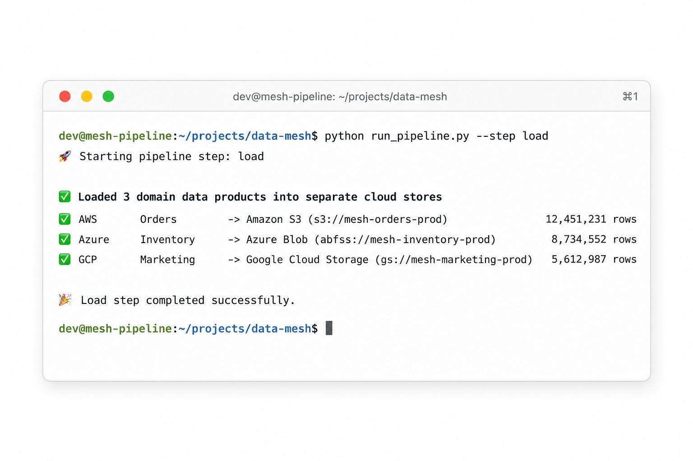

```text
[pipeline] Loaded 3 domain data products into separate cloud stores:
   AWS   (Orders)    -> warehouse/orders.db      (10 rows)
   Azure (Inventory) -> warehouse/inventory.db   (6 rows)
   GCP   (Marketing) -> warehouse/marketing.db   (8 rows)
```

### 2.3 Start the backend API

The single control plane is the FastAPI app in [app/main.py](./app/main.py), which wires
together every platform module (catalog, federation, portal, quality, monitoring, auth).

```bash
uvicorn app.main:app --reload
```

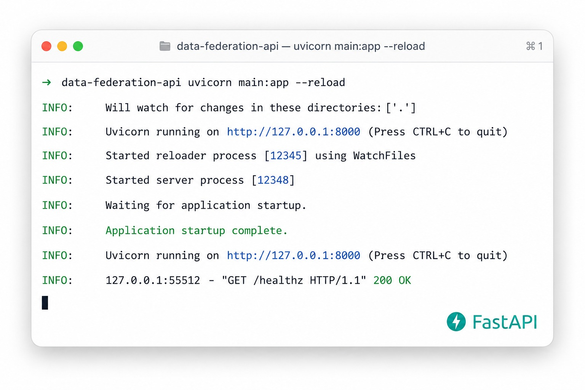

```text
INFO:     Will watch for changes in these directories: ['/data-mesh']
INFO:     Uvicorn running on http://127.0.0.1:8000 (Press CTRL+C to quit)
INFO:     Started reloader process [12480] using StatReload
INFO:     Started server process [9032]
INFO:     Application startup complete.
```

Then open the interactive API docs in your browser:

```text
http://127.0.0.1:8000/docs
```

The whole mesh is exposed as an interactive Swagger UI — every layer (catalog, federation,
portal, quality, monitoring) is a clickable, runnable endpoint:

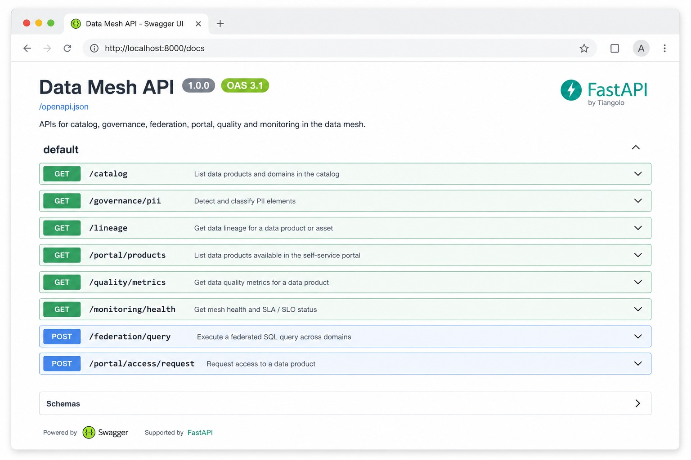

A quick health check confirms the control plane is up (handled by [`root()`](./app/main.py)):

```bash
curl http://127.0.0.1:8000/
```

```json
{
  "service": "Data Mesh",
  "status": "up",
  "domains": ["orders (AWS)", "inventory (Azure)", "marketing (GCP)"],
  "docs": "/docs"
}
```

### 2.4 Try it out

Run a **single federated query that joins all three clouds** at once, routed through the
Trino-style engine in [platform/trino/federation.py](./platform/trino/federation.py):

```bash
curl -X POST http://127.0.0.1:8000/federation/query \
  -H "Content-Type: application/json" \
  -d '{"sql":"SELECT o.customer_id, COUNT(o.order_id) AS orders, m.channel FROM orders.orders o JOIN marketing.marketing m ON m.customer_id=o.customer_id GROUP BY o.customer_id"}'
```

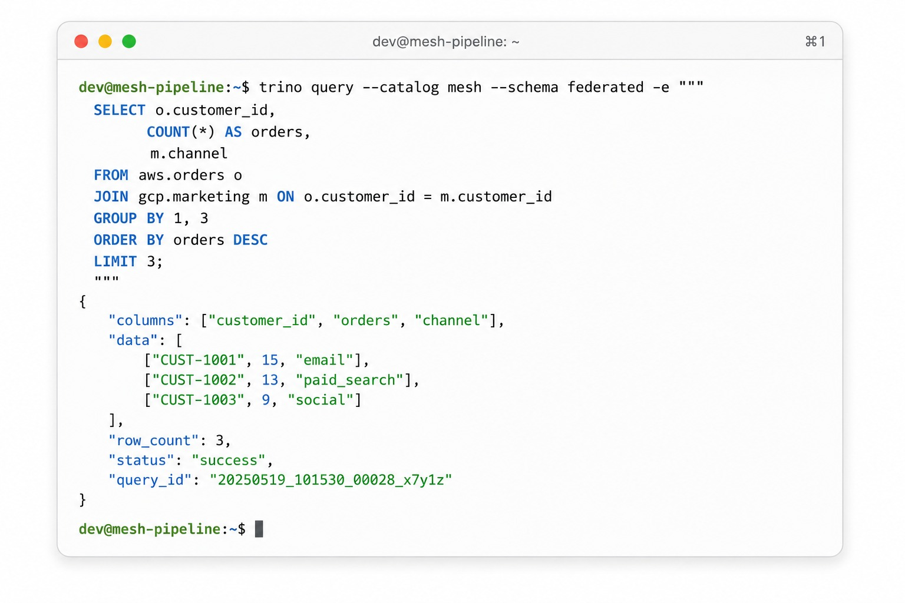

```json
{
  "columns": ["customer_id", "orders", "channel"],
  "rows": [
    {"customer_id": "C-01", "orders": 2, "channel": "email"},
    {"customer_id": "C-02", "orders": 2, "channel": "paid_search"},
    {"customer_id": "C-03", "orders": 2, "channel": "social"}
  ],
  "row_count": 3
}
```

The Orders data lives in `orders.db` (AWS) and the Marketing data in `marketing.db` (GCP),
yet they are JOINed in a single statement — **and neither dataset ever left its own store**.

## 3. Architecture

### 3.1 Architecture Diagram

Three independent domains publish data products into three separate stores. A federation
layer attaches all three and answers cross-cloud SQL; catalog, portal and monitoring sit on
top; a FastAPI control plane and an identity layer wrap everything.

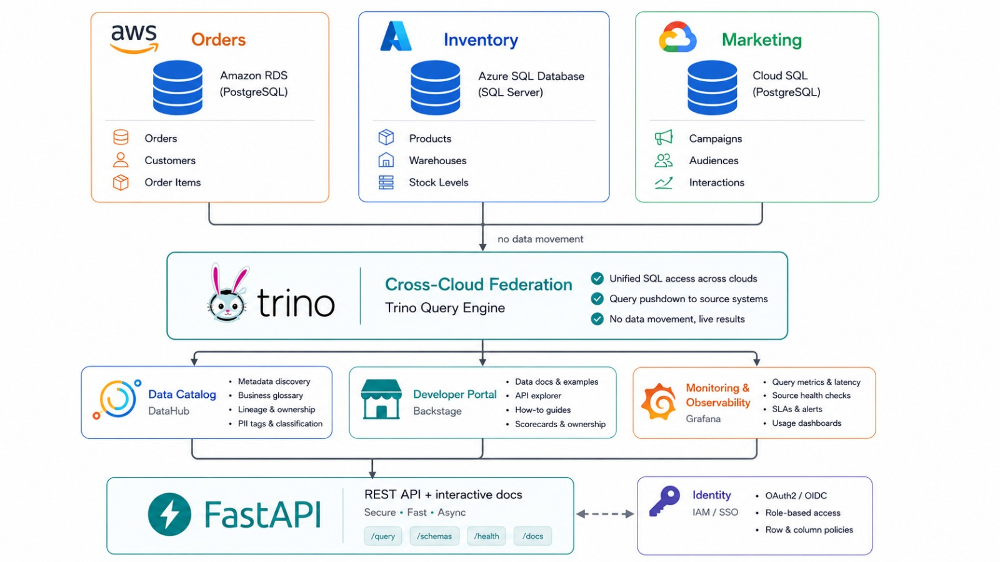

### 3.2 Data Flow

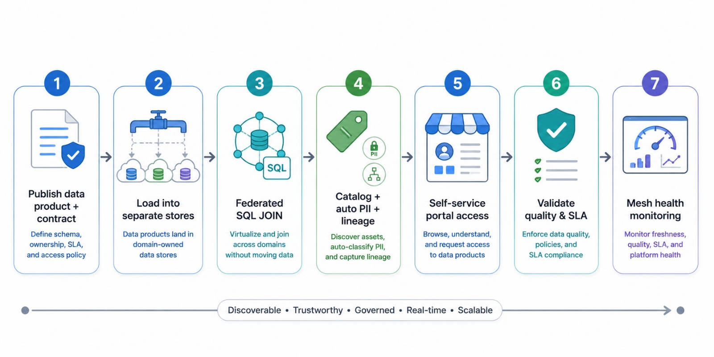

1. Each domain team publishes a **data product**: data + `schema.yaml` (contract) + `quality_contract.yaml` (SLA).
2. The pipeline loads each product into its **own** store — Orders→AWS, Inventory→Azure, Marketing→GCP.
3. **Trino** attaches all three stores and runs federated SQL JOINs — the data never leaves its store.
4. **DataHub** scans the schemas to build one catalog, auto-discovers PII columns, and exposes lineage.
5. **Backstage** lets an analyst browse products and request access (auto-approved in seconds).
6. **Great Expectations + dbt** validate each product against its quality/SLA contract.
7. **Grafana** rolls the quality results into a mesh-health dashboard; **Keycloak** gates access requests.

### 3.3 Project Structure

```text
data-mesh/
├── domain-orders/         # Data product 1 — Orders (AWS)
│   ├── data/orders.csv
│   ├── schema.yaml            # data contract (columns, PII flags, owner)
│   └── quality_contract.yaml  # SLA: freshness, not-null, allowed values
├── domain-inventory/      # Data product 2 — Inventory (Azure)
│   ├── data/inventory.csv
│   ├── schema.yaml
│   └── quality_contract.yaml
├── domain-marketing/      # Data product 3 — Marketing (GCP)
│   ├── data/marketing.csv
│   ├── schema.yaml
│   └── quality_contract.yaml
├── platform/
│   ├── trino/federation.py    # cross-cloud query engine (ATTACH)
│   ├── datahub/catalog.py     # catalog, PII discovery, lineage
│   ├── backstage/portal.py    # self-service data product portal
│   └── keycloak/auth.py       # API-key identity
├── pipelines/load_data.py     # builds the 3 separate "cloud" databases
├── monitoring/sla.py          # Grafana-style SLA dashboard feed
├── app/
│   ├── main.py                # FastAPI backend (all endpoints)
│   └── quality.py             # Great Expectations-style validation
├── warehouse/                 # generated SQLite DBs (the 3 clouds)
├── docs/runbook.md            # domain-team runbook + Trino SQL guide
├── requirements.txt
└── README.md
```

## 4. The Data Mesh, Layer by Layer

A brief, point-by-point explanation of each layer, with the live endpoint that exposes it.

### 4.1 Domain Data Products (the 3 "clouds")

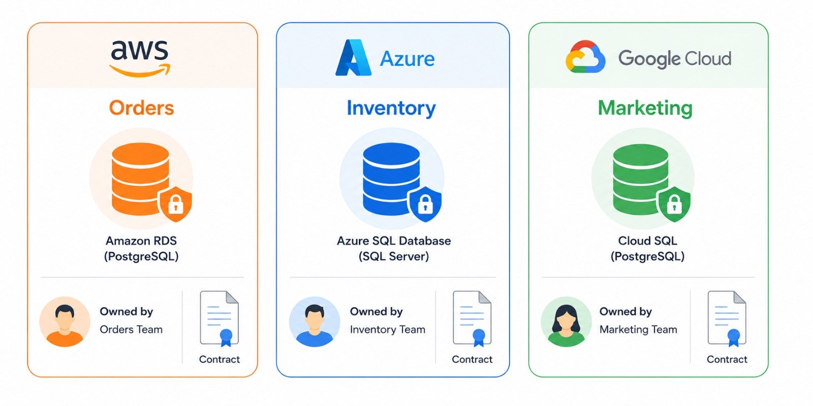

- Three independent domains, each **owning** its own data, schema and SLA — defined in
  [domain-orders/schema.yaml](./domain-orders/schema.yaml),
  [domain-inventory/schema.yaml](./domain-inventory/schema.yaml) and
  [domain-marketing/schema.yaml](./domain-marketing/schema.yaml).
- Stored in **separate** databases so they behave like physically separate clouds.
- `GET /catalog` lists every product with its owner, cloud and description, served by
  [`list_products()`](./platform/datahub/catalog.py).

```json
[
  {"data_product": "orders",    "domain": "Orders",    "cloud": "AWS",   "owner": "orders-team@company.com"},
  {"data_product": "inventory", "domain": "Inventory", "cloud": "Azure", "owner": "inventory-team@company.com"},
  {"data_product": "marketing", "domain": "Marketing", "cloud": "GCP",   "owner": "marketing-team@company.com"}
]
```

### 4.2 Trino Federation (cross-cloud query)

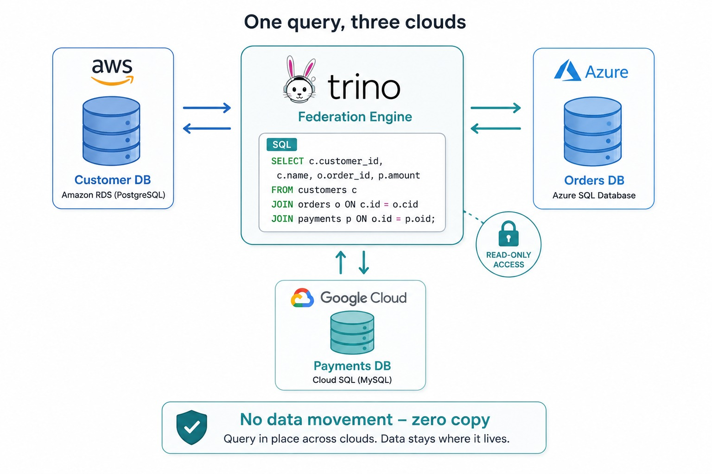

- A single SQL `SELECT` can JOIN `orders`, `inventory` and `marketing` together.
- Implemented with SQLite `ATTACH DATABASE` in [`run_query()`](./platform/trino/federation.py),
  so **no data is copied** between stores.
- Read-only by design — write/DDL statements are rejected.
- `POST /federation/query` runs any SELECT; `GET /federation/samples` returns ready-made queries.

Revenue vs. marketing spend per channel, joining Orders (AWS) with Marketing (GCP) in one query:

```json
{
  "columns": ["channel", "marketing_spend", "order_revenue"],
  "rows": [
    {"channel": "email",       "marketing_spend": 12.1, "order_revenue": 495.14},
    {"channel": "paid_search", "marketing_spend": 46.0, "order_revenue": 460.55},
    {"channel": "social",      "marketing_spend": 9.8,  "order_revenue": 310.1}
  ],
  "row_count": 3
}
```

### 4.3 DataHub Catalog & Governance

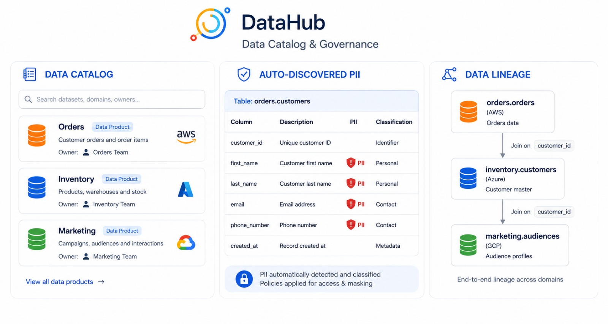

- Auto-scans all three `schema.yaml` contracts into one control plane.
- **Auto-discovers PII** columns for GDPR mapping via [`pii_report()`](./platform/datahub/catalog.py) (`GET /governance/pii`).
- Publishes a lineage graph showing how the products link via [`lineage()`](./platform/datahub/catalog.py) (`GET /lineage`).

```json
{
  "pii_columns": [
    {"data_product": "orders",    "cloud": "AWS", "column": "customer_id", "classification": "PII"},
    {"data_product": "marketing", "cloud": "GCP", "column": "customer_id", "classification": "PII"}
  ]
}
```

The lineage graph shows how the three products link across clouds (`GET /lineage`):

```json
{
  "nodes": [
    {"id": "orders.orders",       "cloud": "AWS"},
    {"id": "inventory.inventory", "cloud": "Azure"},
    {"id": "marketing.marketing", "cloud": "GCP"}
  ],
  "edges": [
    {"from": "orders.orders", "to": "inventory.inventory", "on": "product_id",  "type": "foreign_key"},
    {"from": "orders.orders", "to": "marketing.marketing", "on": "customer_id", "type": "foreign_key"}
  ]
}
```

### 4.4 Backstage Data Product Portal

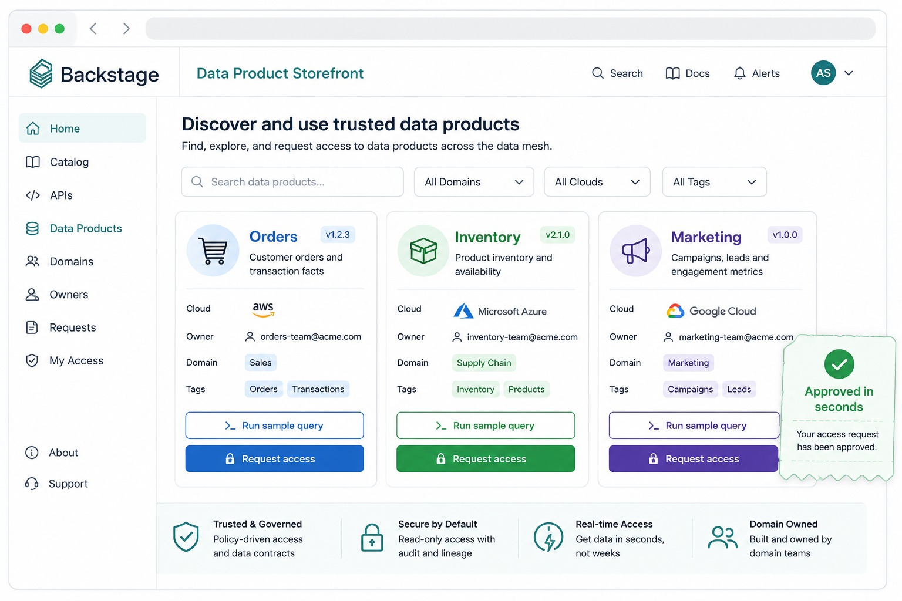

- A "storefront" where analysts discover products and one-click sample queries, served by
  [`storefront()`](./platform/backstage/portal.py).
- **Self-service access**: `POST /portal/access` returns an auto-approved ticket in seconds via
  [`request_access()`](./platform/backstage/portal.py) — the prototype version of the
  "6 weeks → 5 minutes" goal.

The storefront an analyst sees (`GET /portal`):

```json
{
  "storefront": [
    {"data_product": "orders",    "domain": "Orders",    "cloud": "AWS",   "owner": "orders-team@company.com",    "access": "request-required"},
    {"data_product": "inventory", "domain": "Inventory", "cloud": "Azure", "owner": "inventory-team@company.com", "access": "request-required"},
    {"data_product": "marketing", "domain": "Marketing", "cloud": "GCP",   "owner": "marketing-team@company.com", "access": "request-required"}
  ]
}
```

Requesting access returns an auto-approved ticket (`POST /portal/access`):

```json
{"ticket_id": "REQ-0001", "analyst": "ana.analyst@company.com",
 "data_product": "orders", "status": "approved", "approval": "auto"}
```

### 4.5 Quality & SLA Contracts

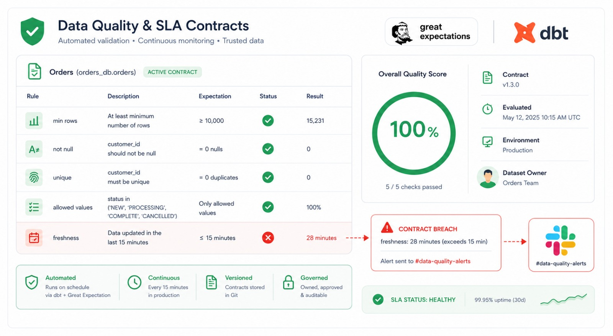

- Each product is validated against its `quality_contract.yaml` by
  [`validate()`](./app/quality.py): completeness, not-null, uniqueness, allowed values,
  non-negative checks. See [domain-orders/quality_contract.yaml](./domain-orders/quality_contract.yaml).
- A failing check is a **contract breach** (the trigger for a Slack alert in the real system).
- `GET /quality` validates all products; `GET /quality/{product}` validates one.

A full validation report for the Orders product, with every expectation broken out (`GET /quality/orders`):

```json
{
  "data_product": "orders",
  "checks_total": 6,
  "checks_passed": 6,
  "quality_score": 100.0,
  "contract_breached": false,
  "checks": [
    {"check": "min_rows",                    "passed": true, "detail": "10 rows (min 5)"},
    {"check": "not_null[order_id]",          "passed": true, "detail": "0 null values"},
    {"check": "not_null[customer_id]",       "passed": true, "detail": "0 null values"},
    {"check": "not_null[order_status]",      "passed": true, "detail": "0 null values"},
    {"check": "unique[order_id]",            "passed": true, "detail": "0 duplicates"},
    {"check": "allowed_values[order_status]","passed": true, "detail": "unexpected: none"}
  ]
}
```

### 4.6 Monitoring (Grafana-style)

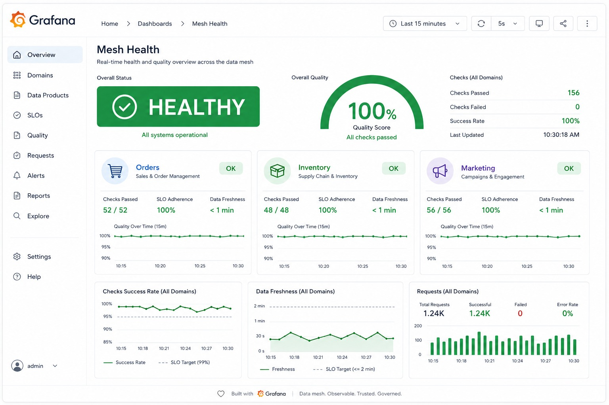

- Rolls all quality results into a single **mesh health** view via [`dashboard()`](./monitoring/sla.py).
- `GET /monitoring/sla` returns per-domain scores and overall status.

```json
{
  "mesh_health": "HEALTHY",
  "average_quality_score": 100.0,
  "contract_breaches": [],
  "domains": [
    {"data_product": "orders",    "quality_score": 100.0, "checks_passed": "6/6", "status": "OK"},
    {"data_product": "inventory", "quality_score": 100.0, "checks_passed": "7/7", "status": "OK"},
    {"data_product": "marketing", "quality_score": 100.0, "checks_passed": "6/6", "status": "OK"}
  ]
}
```

### 4.7 Identity (Keycloak-style)

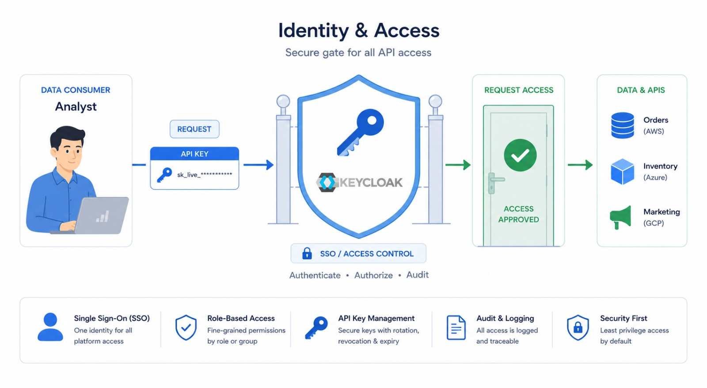

- Access requests require an `X-API-Key` header (demo keys: `analyst-key`, `admin-key`),
  checked by [`authenticate()`](./platform/keycloak/auth.py).
- Stands in for cross-cloud SSO + Trino ACLs — the governance/IAM layer of the mesh.

## 5. API Reference

Every endpoint is also runnable interactively from the Swagger UI at `/docs`. All routes are
defined in [app/main.py](./app/main.py).

| Method | Endpoint | Layer | Purpose |
|---|---|---|---|
| `GET`  | `/` , `/health` | — | Service status |
| `GET`  | `/catalog` | DataHub | List all data products |
| `GET`  | `/catalog/{product}` | DataHub | Full schema of one product |
| `GET`  | `/governance/pii` | DataHub | Auto-discovered PII columns |
| `GET`  | `/lineage` | DataHub | Cross-cloud lineage graph |
| `GET`  | `/federation/samples` | Trino | Ready-made federated queries |
| `POST` | `/federation/query` | Trino | Run a federated SELECT |
| `GET`  | `/portal` | Backstage | Data product storefront |
| `POST` | `/portal/access` | Backstage | Request access (needs `X-API-Key`) |
| `GET`  | `/portal/access` | Backstage | Access request log |
| `GET`  | `/quality` | Great Expectations | Validate all products |
| `GET`  | `/quality/{product}` | Great Expectations | Validate one product |
| `GET`  | `/monitoring/sla` | Grafana | Mesh health dashboard |

Example — the full schema contract returned by `GET /catalog/orders`:

```json
{
  "data_product": "orders",
  "domain": "Orders",
  "cloud": "AWS",
  "storage": "s3://orders-domain/olist/  (simulated -> warehouse/orders.db)",
  "owner": "orders-team@company.com",
  "version": "1.0.0",
  "table": "orders",
  "columns": [
    {"name": "order_id",     "type": "TEXT", "pii": false, "description": "Unique order identifier (primary key)."},
    {"name": "customer_id",  "type": "TEXT", "pii": true,  "description": "Customer identifier."},
    {"name": "order_status", "type": "TEXT", "pii": false, "description": "delivered / shipped / canceled / processing."},
    {"name": "order_value",  "type": "REAL", "pii": false, "description": "Total order amount in BRL."},
    {"name": "order_date",   "type": "TEXT", "pii": false, "description": "Order purchase timestamp (ISO date)."},
    {"name": "product_id",   "type": "TEXT", "pii": false, "description": "Foreign key to inventory.product_id."}
  ]
}
```

For the domain-team workflow and a full Trino SQL guide, see [docs/runbook.md](./docs/runbook.md).

## 6. Kaggle Notebook

A polished, presentation-ready notebook lives in [kaggle/data_mesh_in_practice.ipynb](./kaggle/data_mesh_in_practice.ipynb):

```text
kaggle/data_mesh_in_practice.ipynb
```

**"Data Mesh in Practice: Cross-Cloud Analytics Without ETL"** walks through the same
three domains (Olist Orders, Instacart Inventory, GA4 Marketing), builds the federated
warehouse, runs cross-cloud queries, and visualizes the quality/SLA scorecard — a
standalone, professional companion to this backend.

## 7. Conclusion

From this project, we learned how to:
- **Design a Data Mesh architecture**, decomposing a monolith into domain-owned data products.
- **Author data contracts** (`schema.yaml`) and **quality/SLA contracts** (`quality_contract.yaml`) per domain.
- **Federate queries across clouds** with zero data movement, the Trino way.
- **Build a self-service catalog and portal** with automated PII discovery and lineage.
- **Enforce data quality** with Great Expectations-style validation tied to a mesh-health monitor.
- **Add an identity/IAM layer** to gate self-service access requests.
- **Expose the whole platform** through a single FastAPI control plane with interactive docs.

***Thank you for your reading, happy learning.***

## 8. Appendix

This prototype intentionally simulates the enterprise stack (AWS/Azure/GCP, Trino, DataHub,
Backstage, Great Expectations, Grafana, Keycloak) with a laptop-only Python + SQLite stack,
so the architecture can be studied end-to-end without any cloud accounts.

### 8.1 Designs Gallery

- Data Mesh Project Overview

- Data Silos vs Data Mesh

- System Architecture

- End-to-end Data Flow

- Cross-Cloud Federation

- Catalog, PII & Lineage Governance

- Mesh Health Monitoring


### Tech Stack
`Python` · `FastAPI` · `SQLite (ATTACH federation)` · `Pydantic` · `PyYAML` · `Uvicorn`

### Topics
`data-mesh` · `trino` · `datahub` · `backstage` · `multi-cloud` · `data-governance` · `federated-query`
